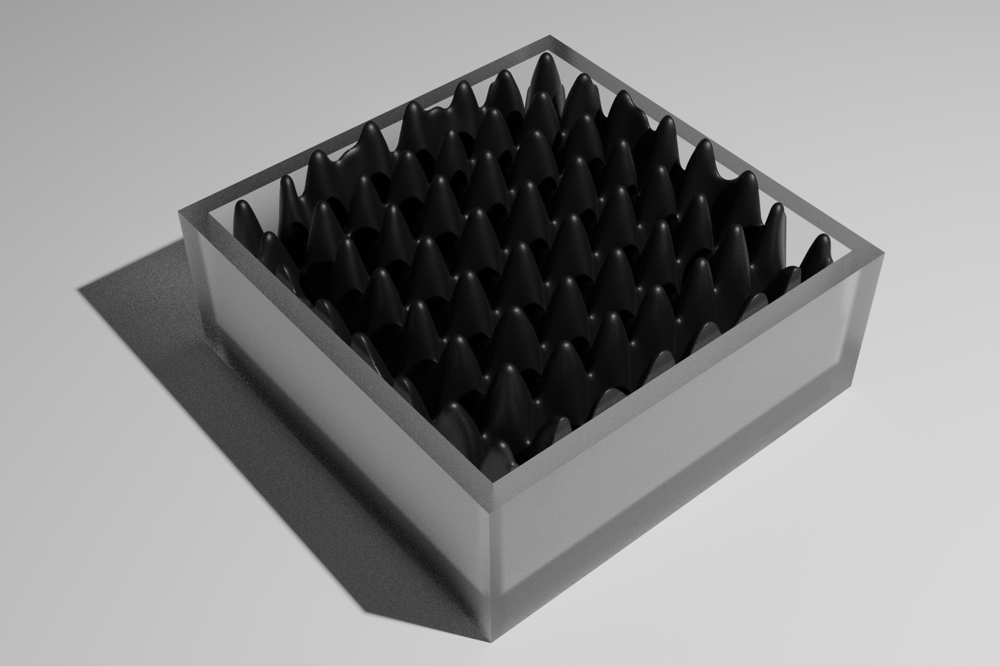

# Mesh-based Ferrofluid




## How to install
before install, please make sure your have your nvidia driver and cuda-11.8 all done in your device
```bash
git submodule update --init --recursive
conda create -n photon-splatting python=3.9
conda activate photon-splatting
pip install -r requirements.txt
pip install torch==2.4.0 torchvision torchaudio --index-url https://download.pytorch.org/whl/cu118
pip install "git+https://github.com/facebookresearch/pytorch3d.git@stable"
pip install external/SoftRas
pip install kaolin==0.17.0 -f https://nvidia-kaolin.s3.us-east-2.amazonaws.com/torch-2.4.0_cu118.html
```

## How to run
- 1. This demo is only used to show you how does our C++-based vulkan ray query works for getting depth map

    ```bash
    cd demo
    python demo_ray_query.py
    ```
    After you have run this command successfully, you will find a depth map is visualized as following: 

     
- 2. This demo is used to show you how to generate a dataset (For simplicity, set it as generating validation dataset only).
    ```bash
    sudo apt install ffmpeg
    cd demo
    python demo_generate_dataset.py --data_type validation
    ```
    After you have run this command successfully, you will find a heat map for scattered surface current is visualized as following: 

     
- 3. This demo is used to show you how to train a 2DGS pipeline.
    ```bash
    python demo_2dgs_train.py -s ../data/mip_nerf/garden -m save/mip_nerf/garden
    python demo_2dgs_render.py -s ../data/mip_nerf/garden -m save/mip_nerf/garden --unbounded --skip_test --skip_train --mesh_res 1024
    ```

## Trouble Shooting

- If you failed of installing `pytorch3d`, the reason is various. Please check this page [Install.md](https://github.com/facebookresearch/pytorch3d/blob/main/INSTALL.md) for any possible conflicts.
- The reason that we are restricting this project to `cuda-11.8` comes from the restriction of `pytorch3d`. In other words, if you can keep `pytorch3d` downloaded without error, you will have no restriction on either `pytorch` or `cuda` version control.
- `cub-1.10.0` is not effective in my test, although it was recommended in the [Install.md](https://github.com/facebookresearch/pytorch3d/blob/main/INSTALL.md) of `pytorch3d`, I recommend you use `cub-2.1.0` instead.
- If you are failed of installing SoftRas, it might caused by 2 AtomicAdd functions's repeated definition.

## Citation

If you find this project useful in your research, please cite:

```bibtex
TBD
```